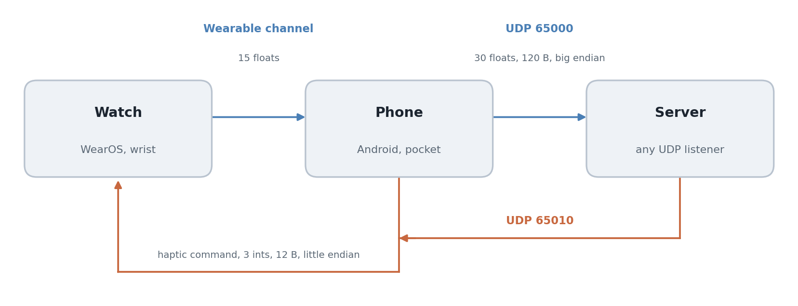

# IMU Streaming App

Yuhyeon Lee · 2025

[](LICENSE)
[](https://developer.android.com/)
[](https://kotlinlang.org/)
[](https://github.com/blueion0612/IMU_Stream_APP_MJU/actions/workflows/build.yml)
[](#limitations)

[**Protocol**](docs/protocol.md) · [**Architecture**](docs/architecture.md) · [**Upstream**](https://github.com/wearable-motion-capture/sensor-stream-apps)

<picture>
  <source media="(prefers-color-scheme: dark)" srcset="docs/figures/hero_system-dark.png">
  
</picture>

**IMU Streaming App** puts a wrist device and a phone on the same UDP socket. The
watch streams its sensors to the phone over the wearable channel, the phone merges
in its own and sends both to whatever server you point it at, and a command sent
back to the phone vibrates the watch. There is no calibration step: start the app
and data flows.

## Features

- **Two devices, one packet.** Every datagram carries a watch block and a phone
  block, so a consumer never has to align two streams.
- **Linear acceleration, angular rate and rotation vector** from each device,
  gravity already removed by the platform.
- **Haptic return path.** A server can vibrate the watch, which makes closed-loop
  experiments possible over the same link.
- **Nothing to calibrate.** The upstream project asks the wearer to hold the watch
  level before streaming. That step is removed.
- **Address configurable in the app.** No rebuild to change the server.

## Quick start

Install both apps from a checkout:

```bash
./gradlew :phone:installDebug
./gradlew :watch:installDebug
```

On the phone, set the server address in Settings. On the watch, toggle **Stream
IMU**. Then receive:

```bash
python scripts/receive_imu.py
```

The script plots both devices live, learns the phone's address from the first
packet that arrives, and carries sliders and a button for firing haptic commands
back. To read the packets yourself see [the protocol](docs/protocol.md); the short
version is 30 big-endian floats on UDP 65000.

## Usage

**Change where the data goes.** Settings on the phone stores the address and port;
the defaults are `192.168.1.138` and `65000`.

**Send a haptic command.** Three little-endian integers to UDP 65010 on the phone:
intensity 1 to 255, pulse count 1 to 10, and milliseconds per pulse 50 to 500.

```python
import socket, struct
sock = socket.socket(socket.AF_INET, socket.SOCK_DGRAM)
sock.sendto(struct.pack("<iii", 200, 1, 100), ("192.168.1.138", 65010))
```

**When nothing arrives.** The watch shows whether it has found the phone; if it has
not, re-pair them over Bluetooth and restart both apps. If the watch is connected
but the server is silent, the phone's address is usually pointing somewhere else,
or the server's firewall is dropping UDP.

## Repository layout

```
phone/                   Android phone module
watch/                   WearOS module
scripts/
  receive_imu.py         UDP receiver with a live plot
docs/
  protocol.md            wire format, both directions
  architecture.md        module map, permissions, what this fork changed
  figures/               README figures and the script that draws them
```

## Requirements

Android Studio with Gradle 8.4, Kotlin 1.8.10 and JDK 8 as the compile target.
Phone on Android 10 or newer, watch on WearOS API 28 or newer. The receiver script
needs Python with NumPy and Matplotlib.

## Limitations

- **The two devices are not time-synchronised.** Each block carries its own `dT`
  and timestamp, and nothing aligns them. A consumer that needs them aligned has
  to do it.
- **The phone emits only when it holds a watch sample**, so a dropped Bluetooth
  link stops the whole stream rather than degrading it to phone-only.
- **UDP, no acknowledgement and no sequence number.** Lost packets are lost
  silently and cannot be detected from the payload.
- **One wearing mode.** Removing calibration also removed the ability to express
  anything but a pocketed phone and a wrist watch.
- Tested on one Samsung Galaxy Watch and one Android phone on a single WiFi
  network. Nothing here has been checked on other hardware.

## License

MIT. See [LICENSE](LICENSE).

This project derives from
[wearable-motion-capture/sensor-stream-apps](https://github.com/wearable-motion-capture/sensor-stream-apps),
which is also MIT. Both copyright notices are carried in `LICENSE`, as MIT requires.
